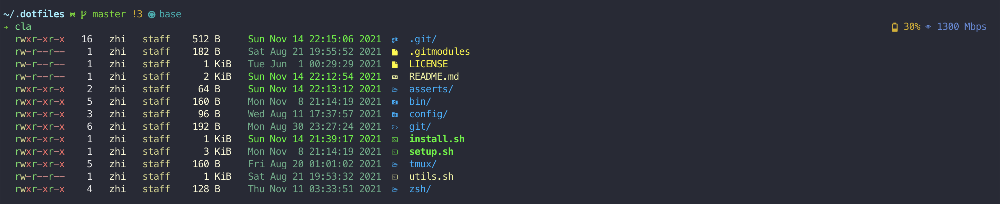

# Personal dotfiles.



This repository contains my personal configuration files, scripts for better terminal experience, which includes:

- Git. Aliases and configurations for git are included.
- Homebrew. Homebrew is a package manager for macOS and Linux.
- Tmux. Tmux is a terminal multiplexer that allows you to run multiple programs in one terminal.
- Zsh. Oh-my-zsh and Zinit are used for the zsh shell.
- Scripts. Some scripts I use for my daily work.

## Installation

1.  clone the repository with its sub-modules into `.dotfiles`.

    ```bash
    git clone https://www.github.com/lzcn/dotfiles.git .dotfiles
    cd .dotfiles
    git submodule update --init --recursive
    ```

2.  install dependencies

    ```bash
    ./install.sh -h
    Usage: install.sh {homebrew|ohmyzsh|zinit|all}
    ```

3.  setup dotfiles

    3.1 manully add the path to `~/.zshenv` or run `./setup.sh env` for `brew` and `conda`

        ```
        # for $HOMEBREW_PREFIX/brew
        export HOMEBREW_PREFIX=
        # for $CONDA_PREFIX/conda
        export CONDA_PREFIX=
        ```

    3.2 setup the configuration files for others.

        ```bash
        ./setup.sh -h
        Usage: setup.sh {brew|env|flake|git|tmux|zsh|all}
        ```

## Zsh configuration

I use `oh-my-zsh` as the zsh framework. To speed up the load of configurations, I use `zinit` to manage the plugins. If you use the [powerlevel10k](https://github.com/romkatv/powerlevel10k) theme and enale the instant prompt (Zsh>=5.4), you might not need the `zinit`. `zsh` is the default shell for MacOS but not for Linux. Some `Linux` distributions only support an older version of `zsh` if installed from the official package maneger. If you do not have the permission to change the default shell or you do want to manually install the newest version of `zsh`. You can install zsh with homebew and enable the local installed `zsh` under the `bash` shell by adding the following lines at the top of `.bash_profile` or `.bashrc`:
```
if [[ -f /path/to/zsh  ]]; then
  export SHELL=/path/to/zsh
  exec /path/to/zsh -l
fi
```
